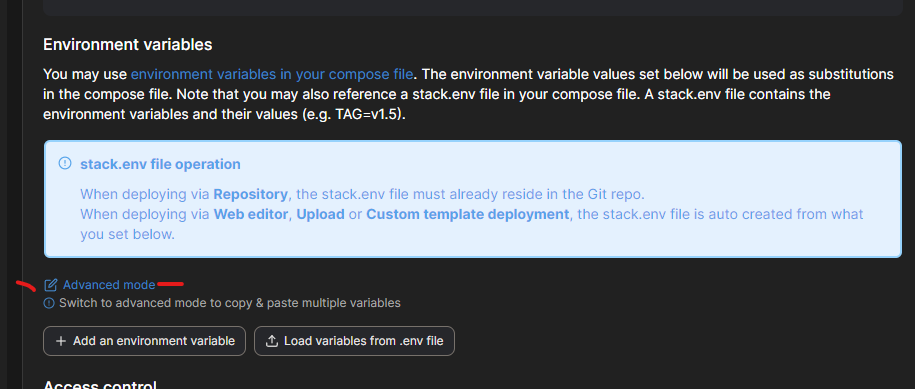
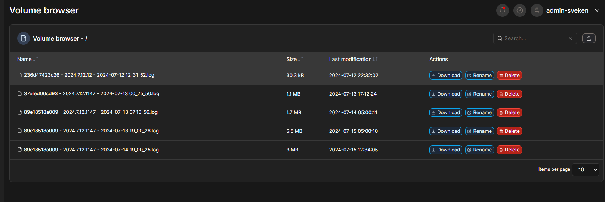

# Portainer Setup

To use the compose files for Portainer the main change is simply replacing the `env_file` value with **stack.env**

## Example Stack


```
services:
  headless:
    container_name: resonite-headless-dotnet8
    image: ghcr.io/voxelbonecloud/resonite-headless-docker:main 
    env_file: stack.env
    environment:
      CONFIG_FILE: Config.json
      ENABLE_MODS: false
      # ADDITIONAL_ARGUMENTS:
    tty: true
    stdin_open: true
    user: "1000:1000"
    volumes:
      - "/etc/localtime:/etc/localtime:ro"
      - "Headless_Configs:/Config"
      - "Headless_Logs:/Logs"
      # - "RML:/RML" # Uncomment if using mods
    restart: on-failure:5
volumes:
  Headless_Configs:
  Headless_Logs:
  # RML: # Uncomment if using mods
```


## Environmental Variables

To add the environment variables on the stack creation page

Click **Advanced mode** under the Environment variables section.



Paste the contents of the [environment-portainer-examples](environment-portainer-examples) file straight into the text box that showed up. 

Swap back to simple mode and edit the values as required. 

## Portainer volume browser

More detailed information on this feature is available on [Portainers official documentation page here.](https://docs.portainer.io/user/docker/volumes/browse)

When using the portainer agent to manage your host you have the ability to browse the docker volumes using a web interface. This makes it easy to download logs and upload your config file or mod files. 


