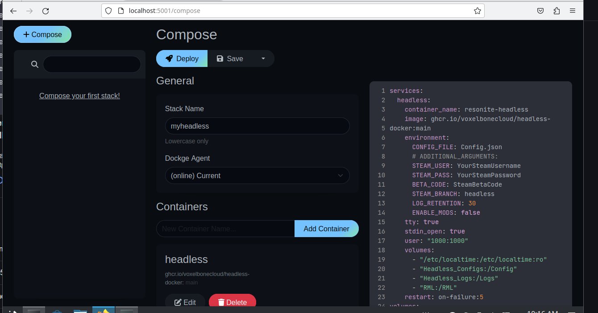
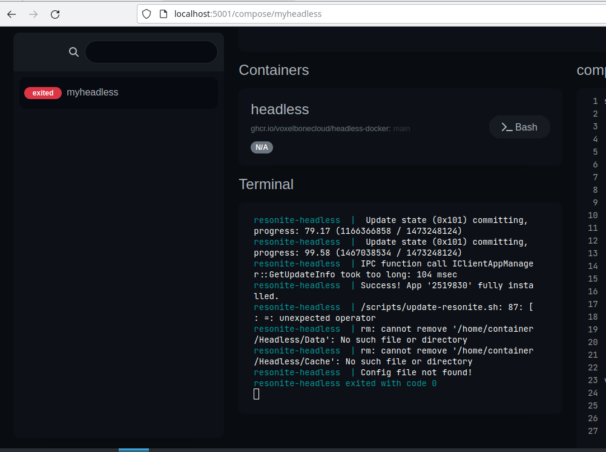
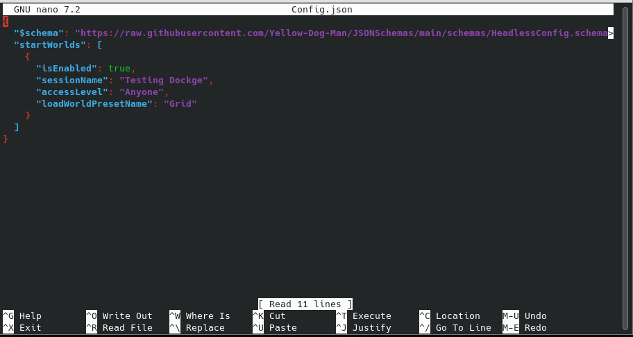

# Setup Guide using Dockge

[Dockge](https://github.com/louislam/dockge) is an easy to use, self hosted docker compose manager that gives you an interactive web panel to easily manage compose files such as the one this project uses.

This Guide assumes you have a supported version of linux pre installed.

#### Known Caveat with Dockge. Dockge currently does not seem to support attaching to the resonite terminal, you will not be able to use headless commands via the terminal until this feature is added. 

### Docker Installation
Official Docker installation instructions can be found at https://docs.docker.com/engine/install/

However for this guide we will be using the [get docker script](https://get.docker.com/) to auto install it for us, You can verify the script using the linked hyperlink. 

Using the script to auto install it run.

```
curl -fsSL https://get.docker.com -o install-docker.sh
```

Then run the script as root or with sudo. 

```
sudo sh install-docker.sh
```

Once this is finished you should be able to run ```docker version``` and it will output a result.


### Dockge Installation
This step is following the install guide found on the [Dockge Github](https://github.com/louislam/dockge)

First step is to create the directory the dockge compose file and its stacks will reside, then change the directory to this to work out of.
You may need to sudo these commands depending on the permission of the account you are using.
```
mkdir -p /opt/stacks /opt/dockge
cd /opt/dockge
```
Then download the Dockge compose file that will run.
```
curl https://raw.githubusercontent.com/louislam/dockge/master/compose.yaml --output compose.yaml
```
Start the Dockge Server
```
docker compose up -d
```
Dockge is now running on port 5001 on the server. Example if it was your location machine it would be, http://localhost:5001

Load the dockge web interface, on installation it will prompt you to set up an admin account with a username and password. Please complete this. 

### Installing the Headless
Once logged into Dockge, Click the ```+ Compose``` button in the top left. 

In this example we are going to use the [no external environment compose file found here](examples\compose-noenv-example.yml).  Paste the contents of this file into the compose window on the right as per this picture. Also give your stack a name.



Replace ```YourSteamUsername```, ```YourSteamPassword``` and the ```SteamBetaCode``` with the correct info. The SteamBetaCode can  be found by finding the Resonite bot in your Contacts list in game. Send ```/headlessCode``` to the bot and it will respond with the SteamBetaCode

Once you have filled out the correct information, hit ```save```, Then ```Start```. You should see activity at the top of the page while it downloads the image. Once this is done, scroll down to the ```Terminal``` section and observe the server while it downloads and installs the headless files from steam.

Once it has finished the setup, it should fail with an ```Config file not found``` error like the screenshot below. This is normal and means its working. We will add the config file in the next step. 



### Setting the folders we will use for the config and log files.

For this headless example we are going to use the directory Dockge sets up automatically, which would be /opt/stacks/myheadless to store the confg, logs instead of using a docker volume. To Do this we remove the Volume: section at the very bottom, and edit the volumes: section as follows. To edit, press the ```edit button``` on the page, this will unlock the compose text section for editing. Then Save afterwards.
```
    volumes:
      - /etc/localtime:/etc/localtime:ro
      - ./Headless_Configs:/Config
      - ./Headless_Logs:/Logs
      - ./RML:/RML
```

Using a ./ at the start will create the folders in the same folder as the compose file which was /opt/stacks/myheadless. Feel free to change this to another location that is easier for you one example could be ```/home/me/headless_Configs:/Config``` However for this example we will continue with the above snippet. 

Your compose file will now look like this
```
services:
  headless:
    container_name: resonite-headless
    image: ghcr.io/voxelbonecloud/headless-docker:main
    environment:
      CONFIG_FILE: Config.json
      # ADDITIONAL_ARGUMENTS:
      STEAM_USER: steamusername
      STEAM_PASS: steampassword
      BETA_CODE: headlesscode
      STEAM_BRANCH: headless
      LOG_RETENTION: 30
      ENABLE_MODS: false
    tty: true
    stdin_open: true
    user: 1000:1000
    volumes:
      - /etc/localtime:/etc/localtime:ro
      - ./Headless_Configs:/Config
      - ./Headless_Logs:/Logs
      - ./RML:/RML
    restart: on-failure:5
networks: {}
``` 
Next we need to fix the permissions for this location, as the headless runs as user 1000. From a terminal run ```sudo chown -R 1000 /opt/stacks/myheadless```

Afterwards start the headless again and wait, it will error again with the no config found, however you should see three folders now under the myheadless folder.

### Adding the Config File
Information about Resonites config file structure can be found on the [official wiki here](https://wiki.resonite.com/Headless_Server_Software/Configuration_File). For this guide we will be using an [example config from the wiki](https://wiki.resonite.com/Headless_Server_Software/Example_Configurations), in particular the Minimal version. 

One way is to use Terminal, cd into the Headless_Configs folder ```cd /opt/stacks/myheadless/Headless_Configs``` then run your favorite text editor, for example ```nano``` .

Copy and paste in your config json, then ctr + s to save, making sure to save it as Config.json. 



#### Important note, The config can be named anything you want, as long as it is the same name as what you have set in the docker compose environment ```CONFIG_FILE: Config.json```. As you can see the default is Config.json. This option allows you to paste many different config files in the directory that can be swapped to for example events. 

You can use other methods that you prefer to copy the config files over such as ftp or use the GUI if installed..


Once saved, you can hit start, wait for the headless to boot and state "world running". Then you are all done!.


### Other notes 

Instead of storing your environmental variables in the compose file, Dockge has a dedicated section for these. 
To use this feature instead replace your environment section with ```env_file: .env```